# Encrypted NFT Demo

This is an end to end implementation of the Encrypted NFT construction. The project consists of a Move smart contract packag (`package/`), the application frontend (`app/`) and the backend server (`backend/`). 

We first install Sui CLI for various utility operations. Then we go over how to deploy the smart contract, configure and run the backend and application frontend for the complete demo. 

## Install Sui CLI

First, follow the [Sui installation instruction](https://docs.sui.io/build/install) to get Sui CLI if needed. This demo uses `devnet` by default, so set up a devnet environment in the CLI if this is not done before:

```bash
cargo install --locked --git https://github.com/MystenLabs/sui.git --branch devnet sui
sui client new-env --alias devnet --rpc https://fullnode.devnet.sui.io:443
sui client switch --env devnet
```

Then make sure the active environment is devnet, and also confirm an active address is present in keystore. This corresponds to the private key for deploying the smart contract. 

```
sui client active-env
sui client active-address
```

If needed, create a new private key and its new address, then switch to use it:

```bash
sui client new-address secp256k1
sui client switch --address 0xYOUR_ADDRESS
```

Request some test coins from the devnet faucet, replace the recipeint with the active address from above: 

```bash
curl --location --request POST 'https://faucet.devnet.sui.io/gas' \
--header 'Content-Type: application/json' \
--data-raw '{
    "FixedAmountRequest": {
        "recipient": "0xYOUR_ADDRESS"
    }
}'
```

## Publish the Encrypted NFT Smart Contract

To publish the smart contract, run the script:

```
# make sure the active env is devnet
sui client switch --env devnet
sui client active-env

# build package and publish using the script
sui move build
cd app/publish/
./publish.sh 
```
If there is no error in`.publish.res.json`, the contract is published successfully and an `app/.env` file is created with the package id and the network you published to.

```
    {
      "type": "published",
      "packageId": "0xCONTRACT_ADDRESS",
      "version": "1",
      "digest": "EkL2Dx3hp7v61wmwWg884jb61GFgqVjBUCqxVsNc2s4z",
      "modules": [
        "private_nft"
      ]
    }
```

The `app/.env` should look like the following: 

```
VITE_PACKAGE_ID=0xCONTRACT_ADDRESS # confirm using explorer the contract is indeed published
VITE_ACTIVE_NETWORK=devnet # should be devnet
VITE_BACKEND=http://localhost:3000/ # where the backend is running on
```

This sets the default server running at `http://localhost:3000`. This can be changed in `backend/server.ts#175` by modifying the number after `app.listen(3000 ...)`.

## Configure Backend

The backend server holds the S3 credentials and also the stores the user address maps to users' encryption keys. It supports endpoints that does the obfuscation and 
Copy the `backend/env.example` file to `backend/.env`. 

### Set up AWS S3 (or storage solution of your choice)

This example uses AWS S3 to store resources such as obfuscated image and the ciphertext. This part can be modified for other storage solutions, feel free to skip this section if not needed. For the purpose of this demo, an AWS S3 bucket can be set up as following:

1. Go to https://aws.amazon.com/s3/
2. Create a bucket with a name. Edit the BUCKET_NAME value in `backend/.env` with this name. 
3. Select "ACLs enabled", unselect "Block all public access" and acknowledge the warining. Leave everything as default. the "Create Bucket". 
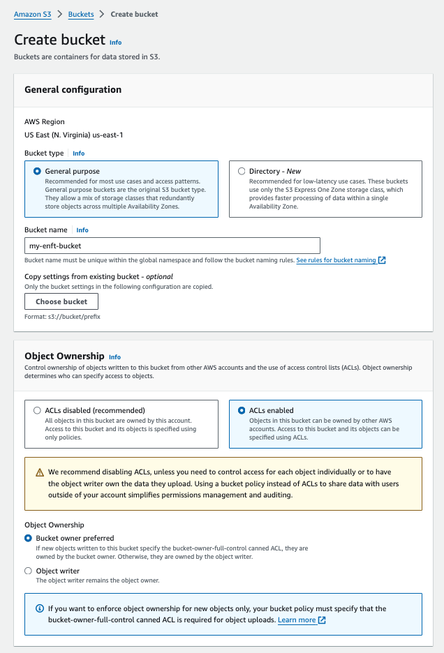
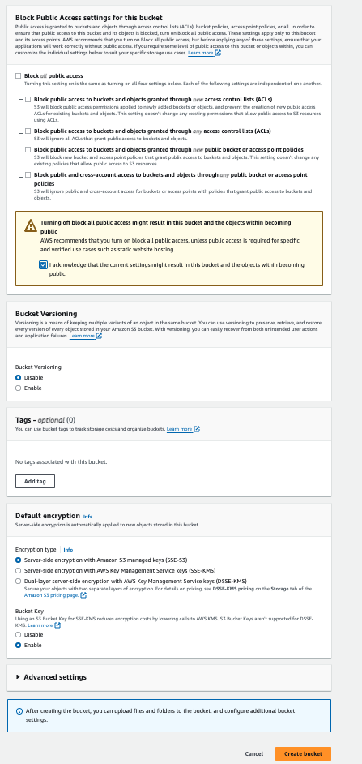
4. Go to IAM (search from AWS services, e.g. https://us-east-1.console.aws.amazon.com/iam/home?region=us-east-1#/users). Go to "Users" then "Create User" with any name. 
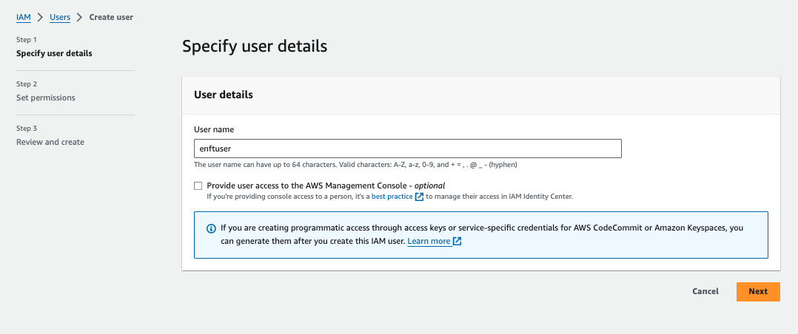
5. Choose "Attach policies directly" then select "AmazonS3FullAccess". Click "Next", leave everything unchanged, then click "Create user".
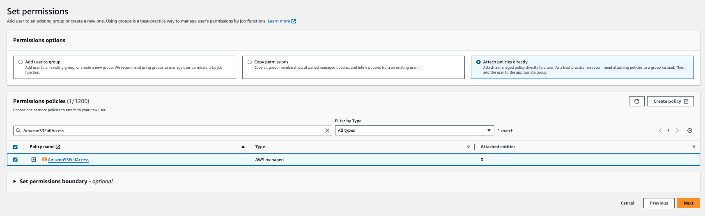
6. Choose "Application running outside AWS", then "Create Access Key", copy the "Access key" value to BUCKET_KEY and the "Secret access key" value to BUCKET_SECRET to `backend/.env`. 
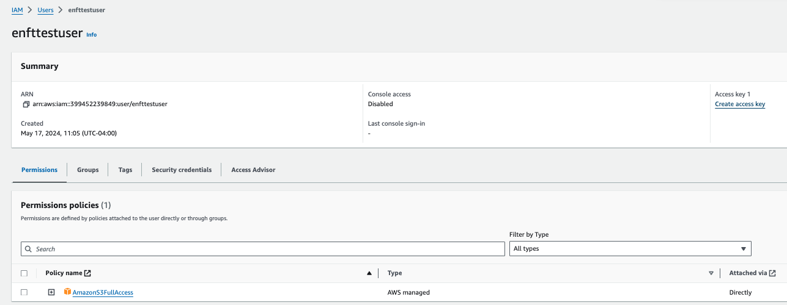


The final `backend/.env` should be populated as follows:
```
BUCKET_REGION="us-east-1" # can be found in properties tab for the bucket. 
BUCKET_ADDRESS="https://s3.us-east-1.amazonaws.com" # update the region substring if needed, the rest of the string should not change. 
BUCKET_NAME="my-enft-bucket" # update to the bucket name from step 2. 
BUCKET_FOLDER="encryptedNFT" # this can any value you define, all resources will be saved in this folder. 
BUCKET_KEY="..." # update to access key value from step 6
BUCKET_SECRET="..." update to the secret access key value from step 6
```

## Run backend and frontend

To run the backend, from `backend/` run `pnpm install && pnpm dev`.
In another tab, to run the frontend, from `app/` run `pnpm install && pnpm dev`.

## Exploring the demo

Open a browser and navigate to frontend localhost (by default). If you changed the port, input the correct port. 
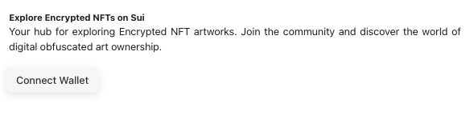
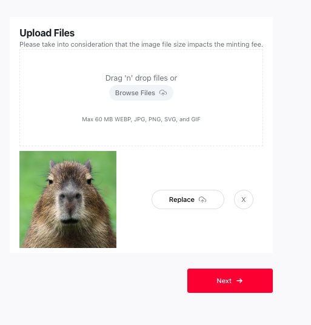
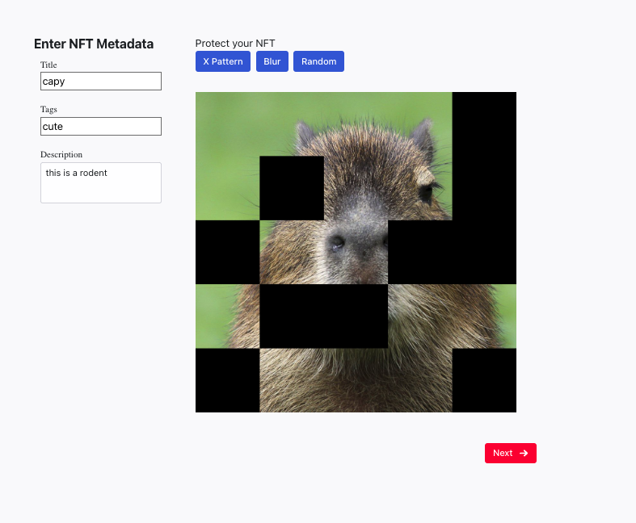
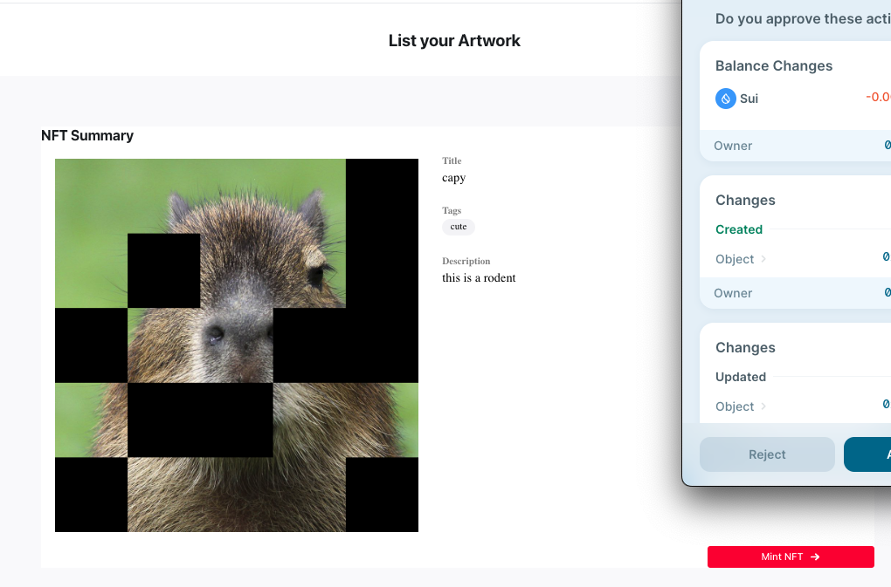
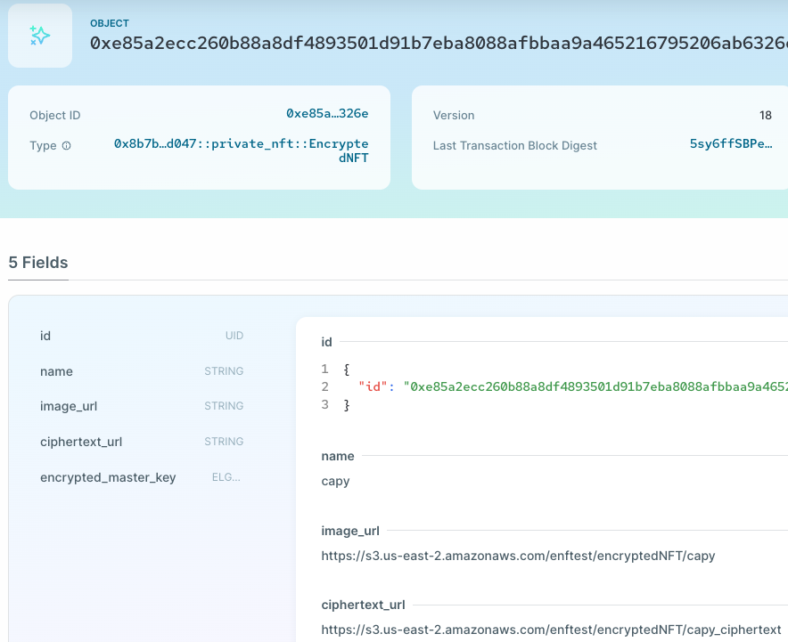
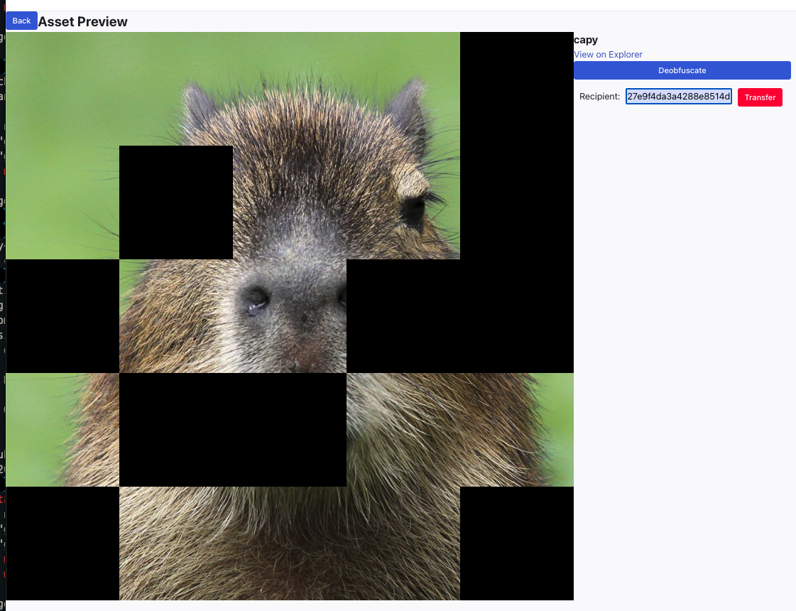
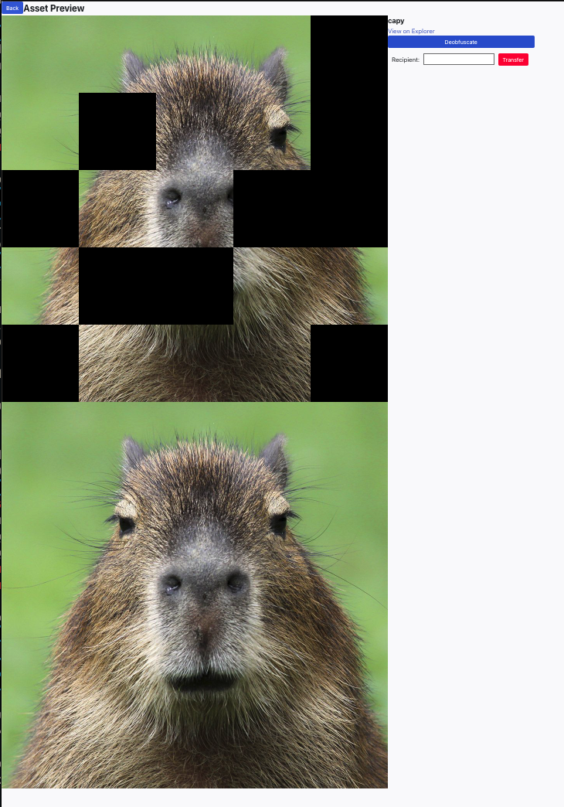

## CLI 

We also provide all implementations in Rust, see `cli/` for code and [cli/README.md](cli/README.md) for instructions. 