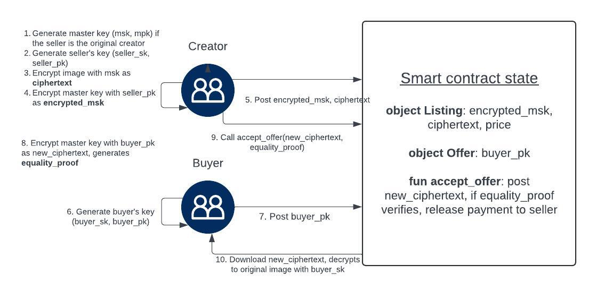
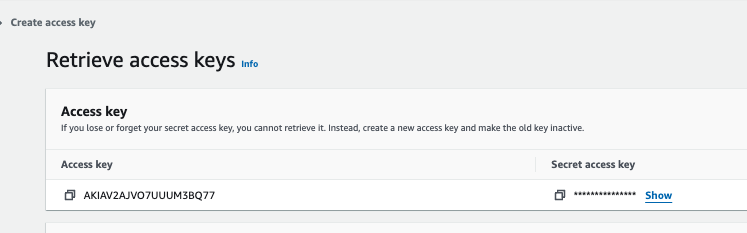

# Encrypted NFT Overview 

Encrypted NFTs introduce a new paradigm in digital asset management by offering on-chain privacy for NFTs. By incorporating encryption to cloak NFTs partially, this model ensures that detailed content of the digital asset is exclusively accessible to the NFT owner. This level of exclusivity elevates the value and uniqueness of the digital asset, and also enables applications such as freemium access models and try-before-you-buy features. 

This innovative framework leverages Sui's native on-chain primitives in Move, such as Elliptic Curve operations and Zero Knowledge proof for ElGamal encryption consistency.

Here we describe a general listing and sales flow that involves the NFT creator and the buyer, see the diagram below.



1. The creator generates a master encryption key off-chain. 
2. The creator encrypts the image to ciphertext using the master encryption key off-chain.
3. The creator selects or randomly defines the bytes that he wishes to be obfuscated on-chain. Then he generates the ciphertext encrypted under the master key. 
4. The creator lists the obfuscated image, ciphertext on-chain for sale. 
5. A buyer submits an offer to buy with payment and his public key. 
6. The creator accepts the offer by producing the new ciphertext encrypted under the master encryption key, and the encrypted master key encrypted under the buyer's public key, and its Elgamal encryption consistency proof. 
7. If the proof is verified on-chain, the creator claims the payment, as well as transfers the ciphertext and the encrypted master key to the buyer. 
8. The buyer downloads the encrypted master key and decrypts it using his own private key. He then downloads the ciphertext and decrypts it using the master key. 
9. In the resell flow, the seller does not no need to perform master key generation, step 2-7 remains the same, as the creator is now the reseller. 

## Smart Contract

At minimum, the smart contract is required to implement the following: 

1. When the seller lists the item: The seller must list the ciphertext and its encrypted master key.

2. When the buyer makes an offer: The buyer must submit the payment along with his public key.

3. When the seller accepts an offer, the seller must provide the current encrypted master key under the buyer's public key, along with the encryption equality proof to show the new encrypted master key is consistent with the encrypted master key under the owner's public key. As part of this step, the proof must be verified as implemented in `fun equality_verify` for the seller to claim the payment.

We provide a complete implementation in this repo with its example frontend and backend code. 

## Terminology and Notations

### Master encryption key

The is an symmetric encryption key used to encrypt and decrypt between the original image and the ciphertext. This master key does not change by ownerships, so every buyer and seller that were able to decrypt the image can alway decrypt it and has the master key. 

In this implementation, the master key is represented as a G1 element and is converted to an AES key, an AES256 cipher in GCM-mode (authenticated) using the given nonce size 32.

### Public key encryption

The master key is encrypted under the buyer's public key, therefore only the buyer can decrypt the encrypted master key to the original master key. 

In this implementation, the private key is a scalar and the public key is a BLS G1 element.

### Encryption Key Management Considerations

1. Wallet client: An encryption key can be managed by a non-custodial cryptocurrency wallet. With a wallet, the decryption operation with the private key happens in a secure context. To avoid additional burden to manage an additional encryption key, we propose [SIP](https://github.com/sui-foundation/sips/pull/23) that leverages the key derivation path from wallet pre-existing master private key. If adopted by ecosystem wallets, users can import and export private key or mnemonics and a persistent encryption key can be derived and used everywhere.

2. Key server: There are scenarios where a master private key is not available, such as zkLogin and Multisig wallet. We therefore propose an example key server design in this [SIP](https://github.com/sui-foundation/sips/pull/26/files).

### Encryption Key Discoverability

The current implementation requires the buyer to first post his encryption public key when making an offer to buy. However, since the encryption public key is persistent and can be visible to anyone, we propose a standard ([SIP](https://github.com/sui-foundation/sips/pull/29))to make an encryption public key discoverable. This way, a seller can immediately deliver the encrypted NFT once the buyer has made an offer. 

# Encrypted NFT Demo

This is an end to end implementation of the Encrypted NFT construction. The project consists of a Move smart contract package (`package/`), the application frontend (`app/`) and the backend server (`backend/`).

Here we go over how to deploy the smart contract, configure and run the backend and application frontend for the complete demo. 

## Install Sui CLI

First, follow the [Sui installation instruction](https://docs.sui.io/build/install) to get Sui CLI if needed. This demo uses `devnet` by default, so set up a devnet environment in the CLI if this is not done before:

```bash
cargo install --locked --git https://github.com/MystenLabs/sui.git --branch devnet sui
sui client new-env --alias devnet --rpc https://fullnode.devnet.sui.io:443
sui client switch --env devnet
```

Then make sure the active environment is devnet, and also confirm an active address is present in the keystore. This corresponds to the private key for deploying the smart contract.

```
sui client active-env
sui client active-address
```

If needed, create a new private key and its new address, then switch to use it:

```bash
sui client new-address secp256k1
sui client switch --address 0xYOUR_ADDRESS
```

Request some test coins from the devnet faucet, replace the recipient with the active address from above:

```bash
curl --location --request POST 'https://faucet.devnet.sui.io/gas' \
--header 'Content-Type: application/json' \
--data-raw '{
    "FixedAmountRequest": {
        "recipient": "0xYOUR_ADDRESS"
    }
}'
```

## Publish the Encrypted NFT Smart Contract

To publish the smart contract, run the script:

```
# make sure the active env is devnet
sui client switch --env devnet
sui client active-env

# build package and publish using the script
sui move build
cd package/publish/
./publish.sh 
```
If there is no error in`.publish.res.json`, the contract is published successfully and an `app/.env` file is created with the package id and the network you published to.

```
    {
      "type": "published",
      "packageId": "0xCONTRACT_ADDRESS",
      "version": "1",
      "digest": "EkL2Dx3hp7v61wmwWg884jb61GFgqVjBUCqxVsNc2s4z",
      "modules": [
        "private_nft"
      ]
    }
```

The `app/.env` should look like the following: 

```
VITE_PACKAGE_ID=0xCONTRACT_ADDRESS # confirm using explorer the contract is indeed published
VITE_ACTIVE_NETWORK=devnet # should be devnet
VITE_BACKEND=http://localhost:3000/ # where the backend is running on
```

This sets the default server running at `http://localhost:3000`. This can be changed in `backend/server.ts#175` by modifying the number after `app.listen(3000 ...)`.

## Configure Backend

The backend server holds the AWS S3 credentials and also stores the user address maps to users' encryption keys. It exposes endpoints that take an image and do the obfuscation, encryption and decryption based on the corresponding keys for the user address. It also obfuscated NFT and its ciphertext to S3 with its configured access keys.

Note that this backend serves as a demo purpose, an authentication system for a key server should be in place in production for all requests for decryption. This is because anyone who has access to the encryption private key can decrypt all private NFTs from ciphertext to its original form. 

Alternatively, one can implement a wallet client that keeps an encryption private key secure and does encryption and decryption in place. See more in [Encryption Key Management](#encryption-key-management) for discussion.

### Set up AWS S3 (or storage solution of your choice)

Copy the `backend/env.example` file to `backend/.env`. 

This example uses AWS S3 to store resources such as obfuscated image and the ciphertext. This part can be modified for other storage solutions, feel free to skip this section if not needed. For the purpose of this demo, an AWS S3 bucket can be set up as following:

1. Go to https://aws.amazon.com/s3/
2. Create a bucket with a name. Edit the BUCKET_NAME value in `backend/.env` with this name. 
3. Select "ACLs enabled", unselect "Block all public access" and acknowledge the warining. Leave everything as default. the "Create Bucket". 


4. Go to IAM (search from AWS services, e.g. https://us-east-1.console.aws.amazon.com/iam/home?region=us-east-1#/users). Go to "Users" then "Create User" with any name. 

5. Choose "Attach policies directly" then select "AmazonS3FullAccess". Click "Next", leave everything unchanged, then click "Create user".

6. Choose "Application running outside AWS", then "Create Access Key", copy the "Access key" value to BUCKET_KEY and the "Secret access key" value to BUCKET_SECRET to `backend/.env`. 



The final `backend/.env` should be populated as follows:
```
BUCKET_REGION="us-east-1" # can be found in properties tab for the bucket. 
BUCKET_ADDRESS="https://s3.us-east-1.amazonaws.com" # update the region substring if needed, the rest of the string should not change. 
BUCKET_NAME="my-enft-bucket" # update to the bucket name from step 2. 
BUCKET_FOLDER="encryptedNFT" # this can any value you define, all resources will be saved in this folder. 
BUCKET_KEY="..." # update to access key value from step 6
BUCKET_SECRET="..." update to the secret access key value from step 6
```

## Run backend and frontend
This example uses AWS S3 to store resources. This can be modified for other storage solutions. To set up an AWS S3 bucket, go to https://aws.amazon.com/s3/ and create a bucket with a name, then update `backend/.env`.

To run the backend, from `backend/` run `pnpm install && pnpm dev`.
In another tab, to run the frontend, from `app/` run `pnpm install && pnpm dev`.

## Exploring the demo

Open a browser and navigate to frontend `localhost:5173` (by default). If you changed the port, input the correct port. 


## CLI 

We also provide all implementations in Rust, see `cli/` for code and [cli/README.md](cli/README.md) for instructions. 

## Encryption Key Management Considerations

1. Wallet client: An encryption key can be managed by a non-custodial cryptocurrency wallet. With a wallet, the decryption operation with the private key happens in a secure context. To avoid additional burden to manage an additional encryption key, we propose [SIP](https://github.com/sui-foundation/sips/pull/23) that leverages the key derivation path from wallet pre-existing master private key. If adopted by ecosystem wallets, users can import and export private key or mnemonics and a persistent encryption key can be derived and used everywhere.

2. Key server: There are scenarios where a master private key is not available, such as zkLogin and Multisig wallet. We therefore propose an example key server design in this [SIP](https://github.com/sui-foundation/sips/pull/26/files).

## Encryption Key Discoverability

The current implementation requires the buyer to first post his encryption public key when making an offer to buy. However, since the encryption public key is persistent and can be visible to anyone, we propose a standard ([SIP](https://github.com/sui-foundation/sips/pull/29))to make an encryption public key discoverable. This way, a seller can immediately deliver the encrypted NFT once the buyer had made an offer. 


### AWS S3 setup

When creating the bucket make it public with ACL enabled with the option `Bucket Owner preffered`.
Next create an IAM user to get the access key and secret and explained <a href="https://blog.devgenius.io/upload-files-to-s3-on-frontend-80436293">here</a>.
